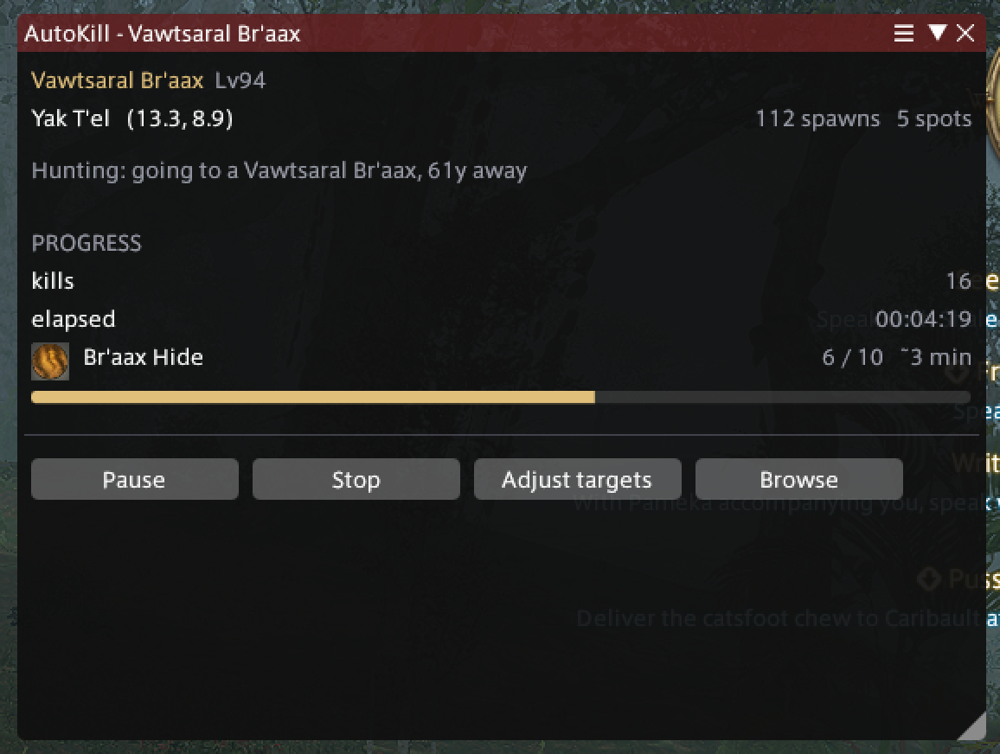
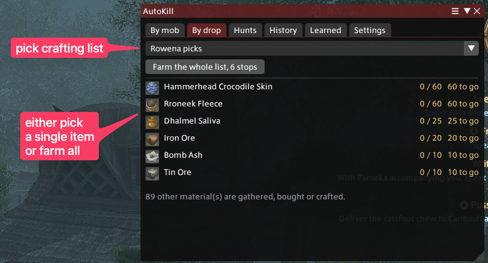
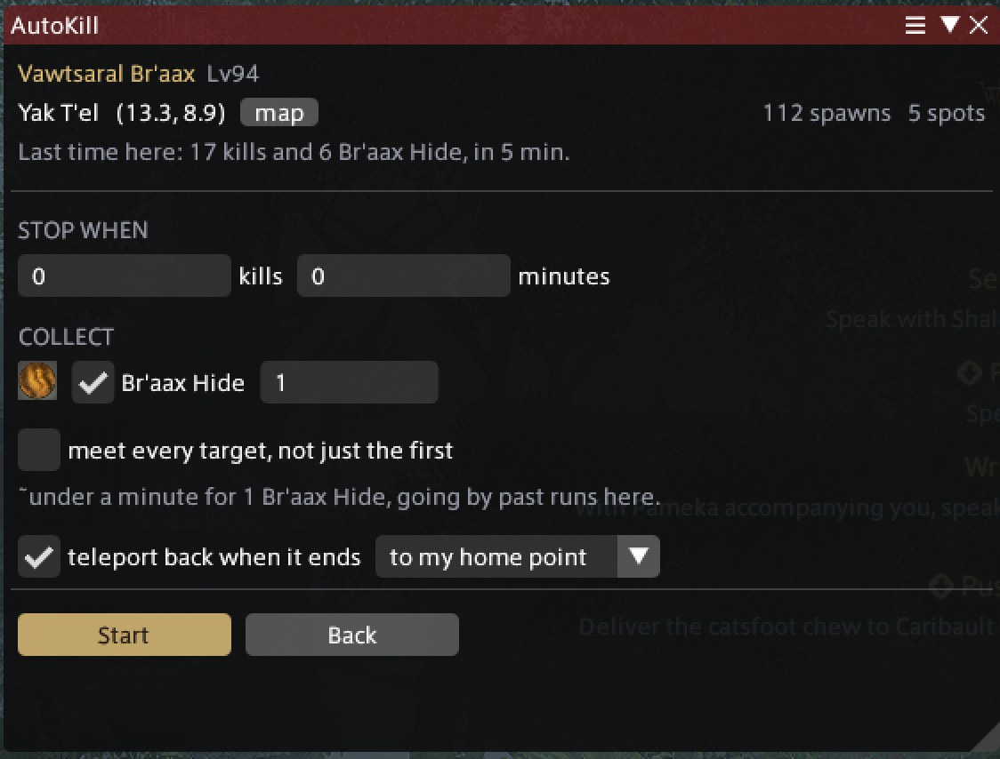
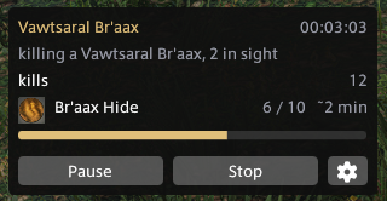

# AutoKill

[](https://github.com/sponsors/d12frosted)


Pick a mob, or pick something you want it to drop, and AutoKill goes and farms it. It
works out where the mob lives, teleports to the zone, mounts, flies over, kills its way
around the field and stops when you have what you asked for.

Movement is [vnavmesh](https://github.com/awgil/ffxiv_navmesh). Fighting is whichever
rotation plugin you already use. AutoKill decides where to go and what to attack, and
lets those do what they are good at.

<p align="center">
  <br>
  <em>Ten hides wanted, six in, and it says what it is doing about the rest.</em>
</p>

## Automation risk

This drives your character unattended in the open world. That is against the game's terms
of service and people do lose accounts for it. Your call.

## What it does

### Choosing a target

**Find something to farm.** Search by mob name, or search for an item and see where to go
for it, with icons, zones and how thickly each place spawns. Mobs that drop something but
have nowhere recorded to find them are still listed, and say so, rather than silently
missing.

**Kill everything in the field that drops it.** Three kinds of petalouda drop the same
scales and stand in the same two fields in Elpis. Searching by item offers the field, not
the species, so the run kills all three instead of flying past two of them and waiting on
one respawn timer. One kind on its own is still there under each field if that is what you
want.

**Or start from a crafting list.** With Artisan installed, By drop offers your crafting
lists. Pick one and it shows the materials a mob can supply, how many are in your bags
and how many are still to find. Choosing one carries the amount through, so the goal is
set as well as the target. Subcrafts are followed down, because a mob drop is never the
item on the list, it is a hide two steps under it. Or press one button and farm the
whole list: one run per material, zone by zone, each going for what is still missing.

<p align="center">
  <br>
  <em>Ninety five materials on the list, six of them something a mob carries.</em>
</p>

**Or work off a hunt bill.** The Hunts tab shows the bills you are carrying and what is
left on each. Pick a target and it goes to that mob, in the zone the bill names, with the
kill count set to what is still owed. That includes the weekly elite bill: every one of
those names a B rank, and if the mark is not up the run patrols its spawn points until it
is. Targets that only appear inside a FATE say so, and can only be picked while that FATE
is running, in which case it goes to where the FATE actually is.

**Or work through the hunting log.** The Log tab shows each class's log and your Grand
Company's: the rank you are on, its ten entries, the mobs each wants and how many are in.
One button farms the whole rank. The entries are grouped into the fewest zones that hold
them and each stop goes after every mob of that rank standing in the field, so a rank
costs about five teleports rather than ten. A log only counts the kill for the class it
belongs to, so a run from here puts that class on rather than picking whatever kills
fastest. A log you cannot farm says which wall it is, dimmed under the ones you can: a
class never picked up, or one with no gearset, since a bare class cannot be equipped.
How far above the class's own level it reaches is yours to set, since the log is ordered
by level and the class levels while it runs.

### The run

**Farm an area, not a spot.** Mobs of one kind are spread over a field in several loose
knots. AutoKill treats the whole field as one place, flies a circuit around it, and moves
on when a knot is cleared instead of standing over a respawn timer.

**Check you can fight it first.** A crafter walks to the field and stands in it, and a
battle job well below the field dies in it, and neither says why. Every mob, field and
place in the window shows its level, and starting a run compares you against it. By
default it changes job for you and goes, preferring something that kills things over
something that survives them; you can name a job to reach for instead, or tell it to
refuse rather than change anything, or to go anyway.

**Stop when you say.** Set any mix of a kill count, a time limit, and an amount of any
item the mob drops, and choose whether the first target ends the run or all of them must
be met. Dying or filling your bags always ends it; after a death it offers to pick the
run back up with what is left of the goals. However a run ends, it sees off the fight it
was in before handing the rotation back, rather than dropping you mid-swing.

<p align="center">
  <br>
  <em>Nothing has started yet. What this ground gave last time is on the left of the decision.</em>
</p>

**Step aside when you step in.** Touch the controls and the run pauses rather than
fighting you for the character: movement it did not ask for, your own teleport, or a
duty taking you away all stop it, and it says so. It can also be paused from the window.
Paused, it keeps counting what it can still see, and the clock a time limit runs
against stops until you resume. Resume and it makes its own way back to the field.

**Learn as it goes.** How quickly a place repopulates is not in any dataset, so AutoKill
measures it and uses it to decide when a spot is worth returning to. The second run over
the same ground routes better than the first. A running goal says roughly how much
longer it should take at the pace shown so far, and planning a field you have farmed
before says what it gave last time and what the goals you are setting should cost.

### Afterwards

**Tell you it finished.** A chat line and a toast when the run ends, with the items as
proper links you can hover. The chat line is local only, like `/echo`, and it is still
there when you come back.

**Bring you home.** Optionally, a run that ends on its own teleports you back: to an
aetheryte in the zone you set off from, or to your home point, your pick. It waits out
the combat the last kill leaves trailing, and a run you stop yourself stays put: you
are standing right there.

**Remember what you ran.** Finished runs are kept with what you asked for, so repeating
one is a single click rather than setting it up again. Each shows kills and items per
hour, so which field is better for something is answerable from your own runs.

## Using it

`/autokill` opens the window. It shows one thing at a time:

- **Browsing**: seven tabs. By mob, By drop, Hunts, Log, History, Learned and
  Settings.
- **Planning**: the area you chose, and what should end the run. A map button flags
  the area on the game map. Nothing starts until you press Start.
- **Running**: a compact overlay beside the game with the status, the bars and the
  time to go, plus Pause, Stop and a cog back to the main window. The main window
  makes way for it and comes back with the result, or carries the run itself if you
  turn the overlay off. Stop targets can be adjusted without stopping, and the tabs
  stay available while a run grinds.

<p align="center">
  <br>
  <em>The overlay is all that stays on screen while a run goes.</em>
</p>
- **Finished**: what happened, until you dismiss it. Or farm the same area again.

### Settings

| setting | what it does |
|---|---|
| mount and fly beyond | how far a destination has to be before it is worth mounting. Lower means mounting for almost every hop; higher keeps it on foot inside an area |
| wait at an empty spot | how long to give a cleared knot before moving on round the circuit |
| announce starts and finishes | the chat line and toast |
| sound when a run ends | one of the game's chat sounds, or none |
| teleport back when a run ends | back to the zone the run set off from, or to your home point, when it ends on its own |
| record runs to a trace file | writes what each run did, for working out afterwards where the time went |
| going as the wrong job | change job automatically, refuse to start and say why, or go anyway |
| reach this far above the class | how far above a class's own level the hunting log will send it. Nothing here changes job: a log only counts for the class it belongs to |
| go as | which job to reach for when changing, out of the ones you have a gearset for |

### Learned

What farming has taught it, per mob and zone: kills, and how quickly the place comes back.
That last one is timed at single spawn points where it can be, which is a respawn, and
across the trip back where it cannot, which reads longer because the trip is inside it.
The tab says which of the two it is showing. It says plainly when it has too few
observations to trust rather than showing a number built from one or two. Entries can be
forgotten one at a time or all at once, which is what you want after a zone is reworked in
a patch.

## What you need

- **vnavmesh** for movement. Nothing works without it, and the window says so.
- **A rotation plugin** for fighting. Wrath Combo is wired up. Without one the loop still
  travels and targets, and leaves the fighting to you.
- An attuned aetheryte in the zone you want to farm, or in the town its aethernet leads
  out of.
- **Lifestream**, only for the Dravanian Hinterlands. It is the one zone in the game with
  no aetheryte of its own: you teleport to Idyllshire and take the aethernet out to one
  of its gates, and Lifestream is what rides the aethernet. Nothing else needs it.
- **Artisan**, only if you want to farm against a crafting list. Its lists are read from
  its config file, so it does not have to be loaded.

If Wrath's auto-rotation is already running, AutoKill leaves it completely alone rather
than reaching into your settings.

## Coverage

Mob positions and drop tables are not in the game's files, so both come from community
data. Merged, that is **9,753 mobs** with somewhere to go and **307 items** with a mob
that can be reached. It is partial and always will be. Drop coverage leans towards older
content, but every expansion has something.

You do not need the drop data to farm an item: item counts are read from your inventory,
so "until I have 30 of these" works for anything at all, as long as you pick the mob.

The hunting log is the exception to all of this. Every mob on all nine class logs, 450
entries of them, stands somewhere the data records inside the zone the log itself names.
The Grand Company logs lose 23 entries out of 90, every one of them a dungeon.

## Installing

AutoKill is not in Dalamud's own plugin list and will not be: that list does not
carry plugins that play the game for you. It installs from a custom repository
instead, which Dalamud supports directly and which handles updates for you.

In Dalamud settings, under **Experimental**, add this to custom plugin repositories:

```
https://raw.githubusercontent.com/d12frosted/autokill/main/repo.json
```

Save, then find AutoKill in the plugin installer. You also need **vnavmesh**, which
installs the same way from its own repository, and a rotation plugin if you want it to
do the fighting.

## Building it yourself

Requires the .NET 10 SDK and a Dalamud dev install.

```sh
./scripts/install.sh              # build and install
./scripts/install.sh --status     # what is built, what is registered
./scripts/install.sh --uninstall  # remove it again
```

After the first install you can run it again with the game still open: it copies the new
build across and Dalamud reloads the plugin in place.

The build finds Dalamud automatically on Windows, macOS and Linux; set `DALAMUD_HOME` to
override. Building from macOS or Linux works because the project targets Windows
explicitly.

## Layout

| project | what it is |
|---|---|
| `AutoKill` | the plugin: data, UI, IPC, and the farming loop |
| `AutoKill.Core` | logic that never sees the game, so it can be tested anywhere |
| `AutoKill.Tests` | tests for `AutoKill.Core` |
| `tools/data` | generates the spawn position data embedded in the plugin |

```sh
dotnet test AutoKill.Tests/AutoKill.Tests.csproj
```

### Releasing

Add what changed to [CHANGELOG.md](CHANGELOG.md), bump `<Version>` in
`AutoKill/AutoKill.csproj`, commit, then tag it:

```sh
git tag v0.2.0 && git push origin v0.2.0
```

CI builds, tests, publishes the release with the zip attached, and commits the updated
`repo.json`. Dalamud picks the new version up from the manifest on its next check and
offers it as an update.

`./scripts/package.sh` does the same locally if you would rather do it by hand. It
refuses nothing, so mind that the manifest and the release have to agree: Dalamud checks
the version in the manifest against the assembly it downloads.

## What changed

See [CHANGELOG.md](CHANGELOG.md).

## Why things work the way they do

See [docs/adr](docs/adr) for the decisions and their reasons, including where the data
comes from, why spawn positions carry no height, and why a run is a state machine rather
than a sequence.

## Support

If you enjoy this project, you can support its development via
[GitHub Sponsors](https://github.com/sponsors/d12frosted) or
[Patreon](https://www.patreon.com/d12frosted).
